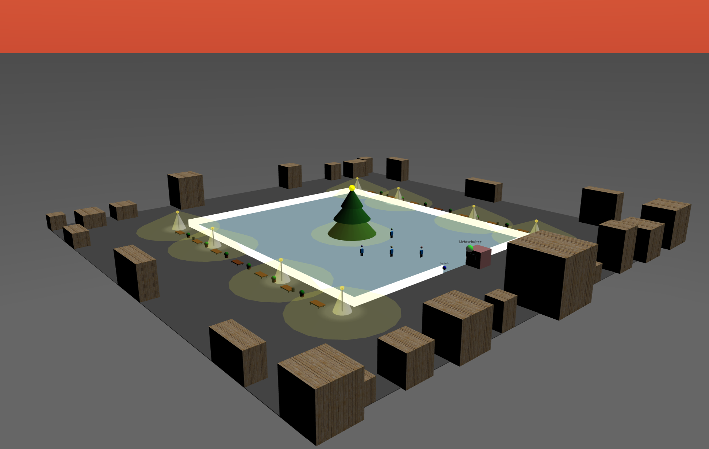

# ❄️ Interactive 3D Christmas Marketplace & Ice Rink (VRML)

A complex, interactive 3D virtual environment built using **VRML (Virtual Reality Modeling Language)**. The project simulates a winter marketplace featuring an ice rink, houses, lanterns, custom-modeled animated skaters, and a dynamic day/night environmental switching system.

---

## 🚀 Key Technical Features

* **Scene Graph & Prototypes (`PROTO`):** Reusable 3D components and complex models (such as the animated ice skater in `Projekt/Eislauefer.wrl`) encapsulated using external prototypes (`EXTERNPROTO`).
* **Interpolated Animations:** Smooth character motion and limb pendulums implemented via `PositionInterpolator` and `OrientationInterpolator` nodes driven by `TimeSensor` clocks.
* **Advanced Lighting & Shading:** Custom lighting setups featuring dual-cone `SpotLight` sources inside street lanterns, a global `DirectionalLight` simulating sunlight, and flashlights attached to characters.
* **Scripted Interactivity (JavaScript):** Embedded JavaScript logic (`Script` nodes) controlling interactive light switches (lantern toggles) and a comprehensive Day/Night cycle that dims environmental lighting and activates flashlights dynamically.
* **Custom Viewpoints & Navigation:** Multiple strategic camera perspectives (`Viewpoint`) including an overhead overview, main entrance, spectator benches, and a first-person perspective tracking individual skaters.

---

## 🛠️ Project Structure

The repository is organized as follows:

```text
vrml-3d-marketplace-ice-rink/
│
├── Dokumentation/
│   └── VRML-Dokumentation.pdf   # Detailed project report & task documentation
│
├── Projekt/
│   ├── miniproject.wrl          # Main scene graph assembling the marketplace
│   ├── Eislauefer.wrl           # Reusable PROTO definition for animated skaters
│   └── Holz.jpg                 # Texture map for architectural elements
│
└── Screenshots/                 # Visual documentation of the 3D scene & lighting states
```

---

## 🎮 How to View

1. Clone or download this repository.

2. Open any VRML-compatible viewer or browser plugin (such as FreeWRL, Octaga Player, or classic Cosmo Player) supporting VRML 2.0 / VR97.

3. Load Projekt/miniproject.wrl to explore the interactive 3D scene.

---

## 📜 Technical Implementation Note
Standard default headlights were disabled (NavigationInfo { headlight FALSE }) to intentionally prioritize custom lighting conditions, emphasizing dramatic shadows, colored light cones, and realistic nighttime illumination.


---

## 👤 Author
Developed by Abdellah Zahif

Hochschule RheinMain


